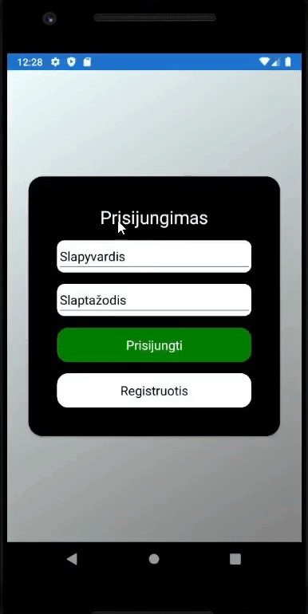

# LLV
---
## LLV description
  LLV is a system which contains php website and Xamarin mobile app. 
  This systems main goal is to present Lithuanian turism objects 
  in interesting and user friendly manner.
---
## website description
  LLV website is made using php programming language. Users can view information about 
  Lithuanian turism objects, leave comments and etc. Admins can add new information 
  and govern the page.
---

  
---
  

---
## app description
  LLV app is a Xamarin mobile app. Users using this app can login or regsiter if they 
  dont have account already. Users can answer questions related to Lithuania. Users collect points 
  and can rank in system ratings.
---
  

---
